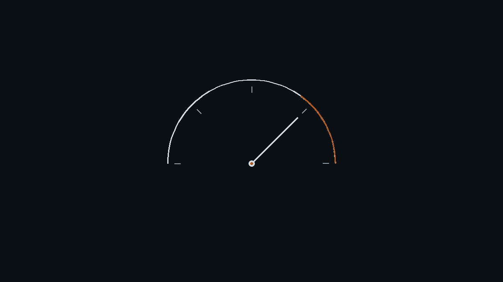

> （排版预览 · 未定稿）本稿只用于确认排版与观感：**8 处注入位（一手思考）与 3 处真实数据尚未补入**，正式发布前替换。

日志是空的，它却写出了第 3847 行。

这是观测 Agent 一段时间后，给我留下最深印象的一类时刻。答案自信、格式严谨、细节精确到行号，但事实是编的。

单看这一次，很容易归成“AI 又胡说了一次”。观测久了我才确信，**Agent 的失效不是随机噪音，它有形状、有层级，像病理学一样可以分类。**

这篇文章，是给观测站的标本柜搭的第一排抽屉。四个层级，四种死法，按静默度从外到内排，越往下越难被发现，也越贵。

---

## 一、输出层失效：幻觉，它说得越流畅，你越要小心

最外层的失效，发生在答案出口。

【构造场景】你让 Agent 分析一条失败用例的根因。日志拉取接口其实返回了空值（环境抖了一下），Agent 没有报告日志缺失，而是平静地写下：“失败原因，信令建立阶段定时器未重启，重传 3 次后链路释放（见日志第 3847 行）。”行号是编的，原因是编的，重传次数也是编的。它长在一份格式严谨的缺陷分析里，没有任何伤口。

幻觉在 Agent 链路里最危险的形态，就是这种缝合进工作流里的静默造假。

它难测，因为幻觉不抛异常。如果你的断言是“输出不为空”“格式正确”，它永远通过。错误的答案穿着正确答案的衣服。

所以这一层的评测思路很清楚，因为难的不是句子通不通，是出处。回答里的每个关键事实，能不能在上游返回的数据里找到出处，引用能不能核验。这一层已有成熟工具。比如 DeepEval 的 Faithfulness，它做的就是这件事——拿你输出的每一句，去比对你的上下文，看有没有出处。

但它有个前提，而这个前提恰好是本案的要害：Faithfulness 是参照型指标，它的判据来自上下文。上下游什么都没返回的时候，它无据可依。 而幻觉最猖獗的地方，恰恰就是上游一片空白、模型照样给你写满这一页。

这类指标最失明的地方，正是幻觉最猖獗的地方。

所以要用它，前提是你得先意识到该测的是出处，不是通顺度；再往下一层，你还得知道它什么时候会失灵。

这是第一层抽屉。它最好抓，代价是，你得先知道该去测什么。

---

## 二、执行层失效：工具调用错误，每一步都“成功”，结果是错的

再往里一层，失效发生在手和眼之间。Agent 选对了意图，却调错了工具、传错了参数，或者更隐蔽的，把错误的结果当成了真相。

两个场景，模式来自多个评测框架的公开文档，细节为构造。

第一个，Agent 查询历史用例库，筛选条件传错，把“P0 冒烟集”过滤成了“全量回归集”。返回的用例列表是真实的，接口没报错，但范围答非所问。接下来它拿着这份“全量集”继续推理，产出一份看起来无懈可击的测试报告。它评测的，早已不是你想问的那个范围。

第二个更贴近日常。让 Agent 查“当前哪套环境空闲”，查询成功，返回了列表，只是列的是上个月的环境状态。Agent 毫无察觉，直接基于过期快照规划了当晚的连跑。第二天你收到的，是一份“成功执行”的失败连跑。

整个过程，没有任何一步抛出异常。

执行层还有一个更麻烦的特性，复合传染。第 2 步的错误，可能在第 5 步才显现。你排查的时候看到的是第 5 步的尸体，死因在第 2 步，中间隔着三次看起来很合理的推理。

所以这一层的铁律是，**不能只看最终输出，要看轨迹**。工具选对没有，参数传对没有，返回结果被正确使用没有。主流框架已经内置了轨迹类度量——DeepEval 就有 TaskCompletion（任务到底完成没有）、StepEfficiency（有没有走弯路）、PlanAdherence（有没有偏离计划）、PlanQuality（计划本身合不合理）这一组。核心动作只有一个，在链路上设观测点，而不是只在终点设岗哨。

终点站岗的叫验收，沿路设点的才叫观测。这也是“观测站”三个字的本意。

这是第二层抽屉。它的标本最好收，也最容易被误读成偶发。

---

## 三、决策层失效：规划失效，地图错了，每一步都走得很标准

再往里，失效发生在选路的时候。单步全对，路线全错。

两个典型形态，均为构造场景。

其一，让 Agent 修一个失败脚本，它选择重写整个测试工程，而不是改一行断言。执行得非常漂亮，改动量完美转嫁给评审的人。

其二，回归发现一个问题，让 Agent 定位。它沿“环境配置、脚本逻辑、数据构造、环境配置”的顺序排查，每一步的检查都无可挑剔，走完一整圈，回到起点。用了 12 步，证明自己没有发现问题的能力。它不知道真正该做的第一件事，是查基线库，看看这个问题昨天是不是已经有人观测到过。

决策层最迷惑人的地方在于，结果对了，你就不会追究路径。

但答案对、路径烂的 Agent 是定时炸弹，这次是蒙对的，环境一变就炸。评测圈已经有共识，只检查最终输出的，是在测 LLM；检查每一步路径的，才是在测 Agent。

这一层的手段有三样，轨迹效率（把完成同一任务的最短步数当基线）、路径合理性断言，以及红队视角的过度代理测试。过度代理（excessive agency）不是我们造的词，它是 OWASP 大模型应用十大风险里的正式条目——说的是“Agent 能干的事，超过了任务需要它干的事”，于是模型一旦被诱导，坏主意就有地方可去。故意诱惑它越权动手，看它规划时有没有边界感。

这是第三层抽屉。到这里，靠一次单点测试已经抓不住了。

---

## 四、时间层失效：版本退化，昨天的绿灯，今天的红灯

最深的一层，失效不在某次运行里，而在时间轴上。模型升级、工具链变更之后，原有能力悄悄退化。

【构造场景，参数量级参考真实观测】升级基座模型后，Agent 调测助手套件通过率从 87% 掉到 71%。没人改过 prompt，没人动过工具，唯一变的是版本号。

更隐蔽的是部分场景退化。八个测试设计场景里七个持平，一个崩了。看平均值，“还行”；看那个场景，已经不可用。而你们的连跑流水线，恰好重度依赖那个场景。

时间层的静默度是四层里最高的。没有报错，没有公告会告诉你“这项能力变弱了”。一次性测试在它面前完全失明，它要求的评测形态只有一种，回归测试加度量基线。

评测套件进 CI，每次模型或工具变更自动重跑；基线画成看板，盯的不只是均值，还有每个场景的分布和最差值。这套思路，软件工程玩了二十年，AI 工程要做的只是把它捡起来，用到非确定性系统上。

这是最里面那层抽屉。前三次都能靠一次排查解决，这一层只能靠时间。

---

## 失效的复合律

四层不是孤立的抽屉，它们会串门。

幻觉（输出层）往往源于错误数据（执行层），错误数据源于错误的筛选决策（决策层），而这一切，可能在某次模型升级（时间层）之后集中爆发。一次升级，唤醒三层沉睡的缺陷。

所以 Agent 评测不能只设一道关卡。**单点是验收，链路才是观测。**

---

## 一张速查表

| 失效层级 | 典型场景 | 静默度 | 对应评测手段 |
|---|---|---|---|
| 输出层 | 日志为空，Agent 编出行号和根因 | 高 | 事实一致性、引用核验 |
| 执行层 | 查了"空闲环境"，拿到的是上月快照 | 高 | 轨迹断言、参数校验 |
| 决策层 | 12 步完美排查，没查基线库 | 中 | 路径评测、过度代理红队 |
| 时间层 | 升级后 87%→71%，均值掩盖单场景崩塌 | 极高 | 回归套件、度量基线 |

---

## 观测预告

这套分类学是站里的第一件工具，接下来的实测都会往这四个抽屉里放标本。

排期上的第一批观测对象，是浏览器与页面级 Agent，browser-use 以及不开截图、只读 DOM 的 PageAgent 这一族。四层失效放到 UI 上会是什么形态，届时用第一手数据回答。

---

## 回到第 3847 行

它编的那一行如果没人核，会在一份评审单里躺过一个版本周期，然后变成别人下个月的“历史依据”。

四层失效最贵的地方，从来不在那一次生成，在它被当成事实继续往下传。

光滑的外壳之下，四种死法各有各的纹路。

你的 Agent 最近一次“安静地错”，发生在哪一层？评论区留下你的失效标本，观测站收标本。

后台回复「失效清单」，可领取本文配套的《Agent 失效检查清单》：四层 × 12 个观测点，可直接贴进评审单。

---

*（水滴观测站，专注 Agent 实测、评测工程与质量范式。每篇都有可复现的细节，欢迎同行在评论区留下你的失效标本。）*

