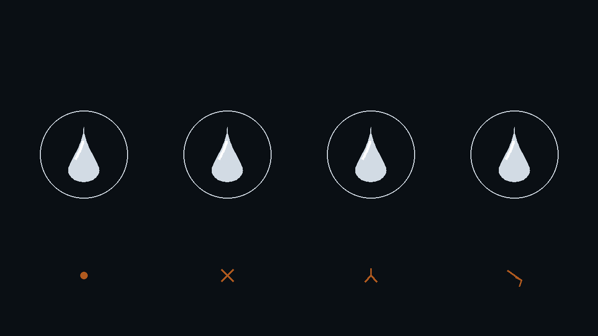
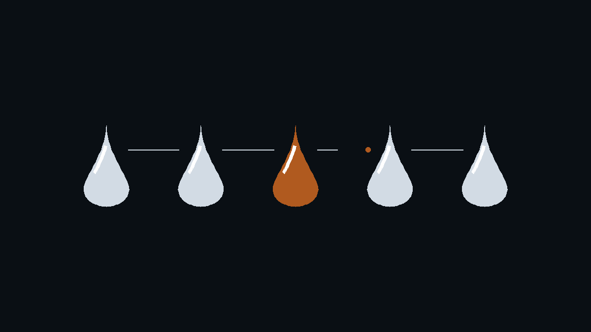
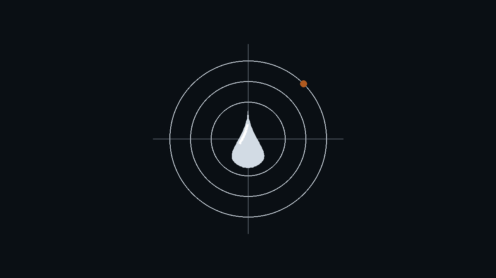

> （极简版预览 · 未定稿）本稿用于确认「读得下去」与排版：正文 1455 字、3 张图。

日志是空的，它却写出了第 3847 行。

这是观测 Agent 一年多来，最让我后背发凉的一类时刻。不是因为它错了，是因为它错得没有破绽，而差点没人发现。

**Agent 的失效分四层，越往里越难被发现。而多数团队的测试，只盖住了最外面那一层。**

> 【构造场景，用于说明模式】下面四个现场是构造的，不是任何一次具体事故。行号、数字均为虚构，请勿当作真实记录引用。

## 一、它说的，不一定是真的

那天日志接口返回的是空值。它没有报告“日志缺失”，而是自己补了一段根因，还标了行号：“见日志第 3847 行”。

行号是编的，原因是编的。

这一类最难抓的地方在于，它不抛异常。如果你断言“输出不为空”“格式正确”，它永远通过。错误的答案穿着正确答案的衣服，要测的不是通顺，是出处。

出处已经有成熟工具，比如 DeepEval 里的 Faithfulness，拿输出的每一句去比对上下文。但它有个盲区：上下文为空的时候，它无据可依。而幻觉最猖獗的地方，恰恰是上游一片空白、模型照样写满一页。

工具最失明的地方，正是它最该盯住的地方。

## 二、它做的，也不一定是真的

再往里一层，问题从“说的话”移到“做的事”。

它要挑一套空闲环境做验证。接口正常返回，只是返回的是一份一个月前的快照。它没有校验时间，直接拿去规划当晚的连跑。第二天我收到的四个字是“执行成功”。

全过程没有任何一步报错。

所以这一层要看的不是最终输出，是轨迹：工具选对没有，参数传对没有，返回的数据被正确使用没有。**终点站岗的叫验收，沿路设点的才叫观测。**

## 三、它选的路，本身是错的

第三层，单步全对，路线全错。

它排查一个问题，沿着“环境配置、脚本逻辑、数据构造、环境配置”走了一整圈，十二步，每一步都挑不出毛病，然后回到起点。它不知道真正该做的第一件事是查基线库：这个问题昨天是不是已经有人观测到。

结果对了，你就不会追究路径。但靠蒙对通过的 Agent 是定时炸弹，环境一变就炸。这一层要测的是路径本身，也就是它有没有走弯路、有没有越权动手。后者在 OWASP 的大模型风险清单里有个专门的名字，叫过度代理。

## 四、它变弱的时候，不会通知你

最深的一层，不在任何一次运行里，在时间轴上。

某次基座模型升级之后，这套调测助手的通过率从 87% 掉到 71%。没人改过 prompt，没人动过工具，唯一变的是版本号。

更隐蔽的是部分退化。八个场景里七个持平，一个崩了。看均值“还行”，看那个场景已经不可用，而流水线恰好重度依赖那一个。

没有报错，也没有公告。

抓住它的手段只有一种：回归加基线。每次模型或工具变更自动重跑，盯的不只是均值，还有每个场景的分布和最差的那一个。

## 四层会串门

幻觉常常来自错误的数据，错误的数据来自错误的筛选决策，而这两件事可能都在某次升级之后集中爆发。一次升级，唤醒三层沉睡的缺陷。

所以 Agent 评测不能只设一道关卡。**单点是验收，链路才是观测。**

| 层级 | 典型现场 | 静默度 | 该测什么 |
|---|---|---|---|
| 输出层 | 日志为空，它编出行号和根因 | 高 | 出处核验、事实一致性 |
| 执行层 | 查“空闲环境”，拿到上月快照 | 高 | 轨迹断言、参数校验 |
| 决策层 | 12 步完美排查，没查基线库 | 中 | 路径评测、过度代理红队 |
| 时间层 | 升级后 87%→71%，均值掩盖单场景崩塌 | 极高 | 回归套件、度量基线 |

## 你盖到了第几层

它编的那一行如果没人核，会在一份评审单里躺过一个版本周期，然后变成别人下个月的历史依据。

失效最贵的地方，从来不在那一次生成，在它被当成事实继续往下传。

接下来的实测会往这四层里放标本。第一批观测对象是浏览器与页面级 Agent，browser-use 以及不开截图、只读 DOM 的 PageAgent 这一族。四层失效放到 UI 上是什么形态，届时用第一手数据回答。

你的 Agent 最近一次“安静地错”，发生在哪一层？评论区留下你的标本，观测站收标本。

后台回复「失效清单」，可领取本文配套的《Agent 失效检查清单》：四层 × 12 个观测点，可直接贴进评审单。

---

*（水滴观测站，专注 Agent 实测、评测工程与质量范式。每篇都有可复现的细节，欢迎同行在评论区留下你的失效标本。）*
